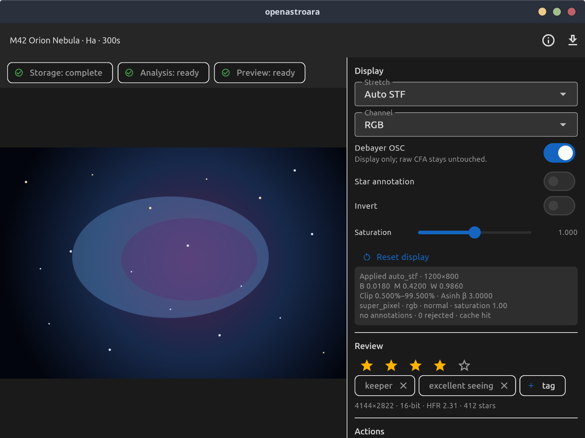

# Frame viewer implementation

Status: Rank 1 client slice. Depends on the frame-operation contracts in PR
899. This slice changes only WILMA and leaves existing session/frame REST
contracts unchanged.

## Ownership

- Server owner: `IFrameRepository` and `IFrameOperationService`.
- Client transport owner: `LibraryClient` / `LibraryApi`.
- Client state owner: `FrameViewerController`, family-keyed by frame ID.
- UI owner: `LiveFrameViewerScreen`.

The daemon remains the source of truth. WILMA never decodes or modifies source
pixels. Render controls request cache variants; metadata and operation results
are read back from the daemon.

## Contracts

The client consumes:

- `GET /api/v1/frames/{id}/metadata`
- `POST /api/v1/frames/{id}/preview`
- `GET /api/v1/frames/{id}/download`
- `POST /api/v1/frames/{id}/reanalyze`
- `POST /api/v1/frames/{id}/rebuild-preview`
- `POST /api/v1/frames/bulk/quarantine`
- `GET /api/v1/jobs/{id}`
- `DELETE /api/v1/jobs/{id}`

Preview response headers are parsed into a typed `FramePreviewApplied` value so
the UI reports the actual black/mid/white points, debayer mode, channel,
annotation count, dimensions, saturation, inversion, and cache result.
Mutations carry `Idempotency-Key`; transport failures retry once with the same
key. Downloads stream to an adjacent temporary file, atomically publish to the
user-selected path, remove partial files after failure/cancellation, and refuse
to overwrite a path that became occupied.

## WebSocket and recovery

`FrameViewerController` filters lifecycle events by `frame_id`, rejects stale
event sequence numbers, and folds:

- `frame.persist_started` / `frame.persist_progress`
- `frame.analysis_started` / `frame.analyzed`
- `frame.preview_started` / `frame.preview_ready`
- `frame.failed`
- `frame.quarantined`

Events update the progress strip and trigger bounded metadata refreshes.
Reanalysis and rebuild also poll their accepted job at a bounded interval as a
fallback when WebSocket delivery is missed. Polling stops on terminal state,
after a fixed timeout, on cancellation, or when the provider is disposed.
Cancellation remains `cancelling` until the daemon reports an authoritative
terminal job state. An unknown terminal outcome is shown as unknown, never
success.

## UI and safety

- Last-issued preview wins; the previous request is cancelled.
- Failed renders preserve the last good pixels and restore controls to the
  options that produced them.
- Quarantine is reversible and never deletes source bytes.
- Reanalysis and preview rebuild expose progress and cancellation.
- Download, reanalysis, rebuild, and quarantine buttons disable while their
  operation is in flight.
- Wide layouts use a persistent inspector; narrow layouts use the metadata
  drawer. Both retain zoom/pan, keyboard focus, explicit loading/error states,
  and the thumbnail fallback.

No profile setting, SQLite migration, simulator mutation, or hardware command
is introduced by this client slice.

## UI evidence

## Verification

- Model parsing and preview-request serialization tests.
- Dio request, response-header, idempotency, retry, streaming-download, and
  partial-file-cleanup tests.
- Provider tests for last-issued-wins, cancellation, bounded job fallback,
  stale WebSocket rejection, lifecycle refresh, and mutation rollback.
- Widget tests for loading, success, failure, controls, metadata, operations,
  quarantine/restore, download/cancel, and narrow/wide layout behavior.
- Full `flutter analyze`, `flutter test`, Unicode scan, and `git diff --check`.
